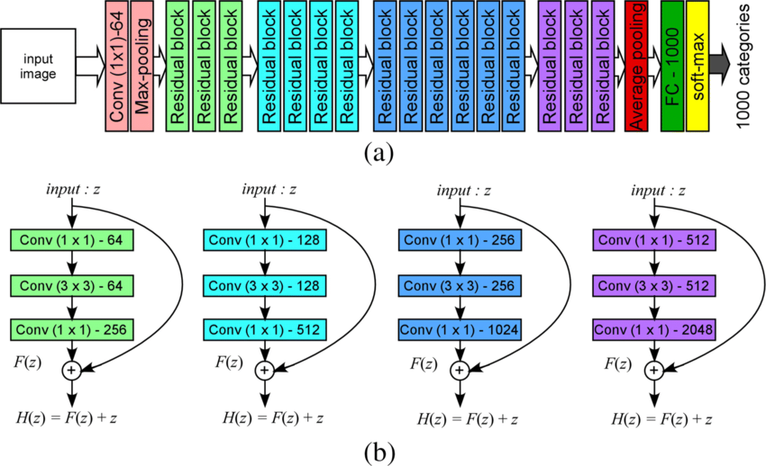
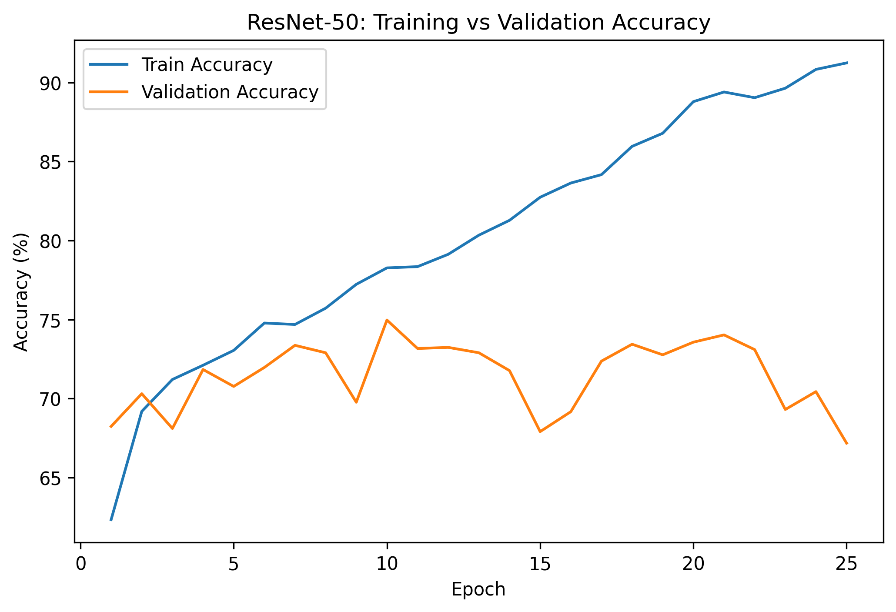
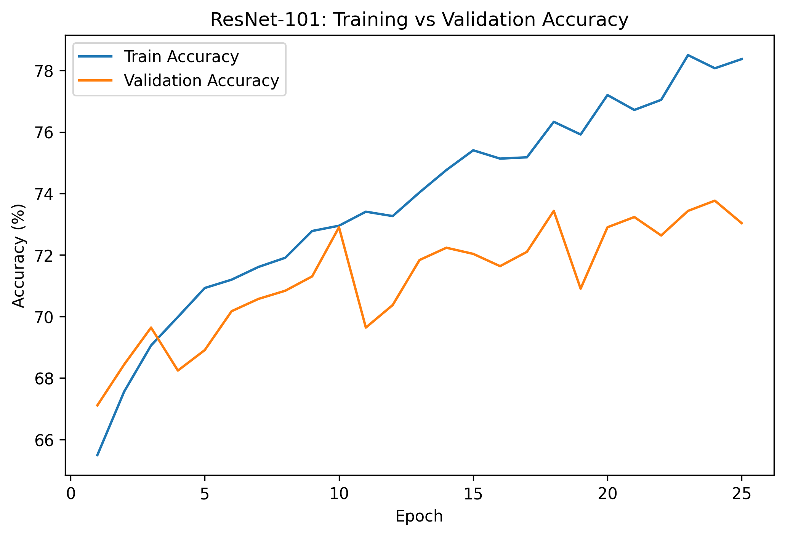
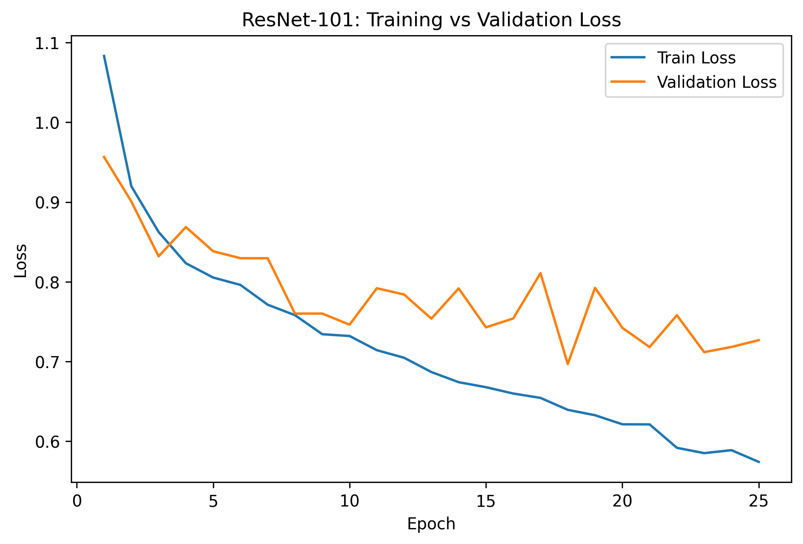

# ResNet on Skin Cancer detection (PyTorch)

A deep learning–based image classification project implementing and fine-tuning a **multiple ResNet convolutional neural network** using PyTorch.  
The project focuses on understanding **residual learning, training dynamics of deep CNNs, and end-to-end ML pipelines**, rather than treating the architecture as a black-box model.

---

## Overview

This project implements a deep convolutional neural network based on **ResNet architectures (50, 101, and 152)**, designed to address optimization challenges in very deep networks using **residual connections**.

The pipeline covers the complete workflow:

- Data extraction and preprocessing (ETL)
- Model implementation and fine-tuning
- Training and evaluation
- Performance analysis

---

## Features -

- Implementation of **ResNet-50, ResNet-101, and ResNet152** using PyTorch
- End-to-end ETL pipeline for image datasets
- Image normalization using ImageNet statistics
- Training and validation performance tracking
- Modular structure for extending to other datasets

---

## Architecture -

### ResNet-50

---

## Model Architecture Summary

The model is based on the **ResNet-50** architecture, which uses deep residual learning to enable stable optimization of very deep convolutional networks.

| Component | Description |
|---------|-------------|
| Block Type | Bottleneck residual blocks |
| Convolutions | 1×1 → 3×3 → 1×1 |
| Number of Convolution Layers | 50 |
| Skip Connections | Identity / projection shortcuts |
| Normalization | Batch Normalization |
| Activation | ReLU |
| Pooling | Adaptive Global Average Pooling |
| Output Layer | Fully Connected classification head |

Residual connections allow the network to learn **residual mappings** instead of direct mappings, significantly reducing degradation and vanishing gradient issues as depth increases.

---

## Dataset Preparation

### ETL Pipeline

The project follows a structured **ETL (Extract, Transform, Load)** pipeline to ensure reproducibility and clean experimentation.

### Extract
- Load image data from kaggle input directory and store it in a pandas dataframe
- Create new columns for full path for each image using image_id and store label encoded class labels

### Transform and Custom Dataset
- Create transform function to convert images to model-compatible resolution (3x224x224)
- Implement the PyTorch `Dataset` interface to enable efficient batching, shuffling, and scalable training via `DataLoader`
- The features passed to the dataset are the full paths to image column, labels are encoded class labels, and the custom transform created above is also passed as a parameter

### Load
- Construct batched DataLoaders for training and validation
- Shuffling enabled for training, disabled for evaluation

This separation allows easy substitution of datasets without modifying model logic.

---

## Model Training

### Loss Function -
- Cross-Entropy Loss for multi-class classification

### Optimization -
- Optimizer: Adam / SGD (configurable)
- Optional learning rate scheduling

### Training Configuration -

- Batch size: Configurable
- Epochs: Configurable
- Device: GPU (CUDA supported)

Training and validation metrics are tracked per epoch to monitor convergence and detect overfitting.

---

## Evaluation

Model performance is evaluated using:

- Classification accuracy
- Training vs validation loss trends
- Epoch-wise performance analysis

These metrics help diagnose optimization issues and generalization behavior.

---

## Results

### Training vs Validation Accuracy

Training accuracy increases steadily, showing the model fits the training data very well. Validation accuracy peaks early (around epoch 10) and then declines, indicating overfitting. The best model is from the early epochs; training longer hurts generalization.

---

### Training vs Validation Loss

Training loss decreases consistently, confirming successful minimization of the objective function.  
Validation loss initially decreases but later trends upward, indicating the onset of overfitting as model capacity begins to exceed generalization constraints.

---

### Test Results

Test Accuracy: 66.13%

Test Loss: 1.31

---

### Interpretation

- The growing gap between training and validation metrics reflects **overfitting**, a common behavior in deep CNNs such as ResNet-50.
- Early stabilization of validation accuracy suggests diminishing returns from continued training beyond mid-epochs.
- These results motivate the use of **early stopping, stronger regularization, or increased data augmentation** to improve generalization.

Overall, the model demonstrates effective optimization and representation learning, but tends to overfit.

---

## Architecture -

### ResNet-101

Similar to ResNet-50, we just add more ResNet layers. We intitialize the ResNet-101 as -
<code> resnet101 = ResNet(resnet_block, [3, 4, 23, 3], 3, 7) </code>, we just use ResNet blocks in the third layer instead of the 6 in ResNet-50 (<code> resnet101 = ResNet(resnet_block, [3, 4, 23, 3], 3, 7)</code>)

## Model Architecture Summary

The model is based on the **ResNet-101** architecture, a deeper variant of **ResNet-50**.

| Component | Description |
|---------|-------------|
| Block Type | Bottleneck residual blocks |
| Convolutions | 1×1 → 3×3 → 1×1 |
| Number of Convolution Layers | 101 |
| Skip Connections | Identity / projection shortcuts |
| Normalization | Batch Normalization |
| Activation | ReLU |
| Pooling | Adaptive Global Average Pooling |
| Output Layer | Fully Connected classification head |

---

## Results

### Training vs Validation Accuracy

Training accuracy increases steadily, indicating stable learning and sufficient model capacity. Validation accuracy improves early and then fluctuates, suggesting mild overfitting but better generalization than ResNet-50. The train–validation gap remains moderate, implying ResNet-101 benefits from depth but still needs regularization or early stopping.

---

### Training vs Validation Loss

Training loss decreases smoothly, showing consistent optimization and effective learning. Validation loss drops early, then oscillates without a strong upward trend, indicating controlled overfitting. Compared to ResNet-50, ResNet-101 maintains a smaller train–validation loss gap, suggesting better generalization.

---

### Test Results

Test Accuracy: 74.18%

Test Loss: 0.70
